# vga-text-engine

[](https://github.com/danieltyukov/vga-text-engine/actions/workflows/ci.yml)
[](LICENSE)

A synthesizable colour VGA text mode display controller in SystemVerilog.

`vga_text_engine` reads 32 bit character cells out of an external buffer over a simple
read only port, turns them into pixels through a programmable 16 entry palette, and
drives VESA correct sync signals for four video modes. It has a real hardware text
cursor, per character colour and effect attributes, two glyph heights selectable at
runtime, and an elastic buffer that keeps the display locked even when the memory
system stalls.

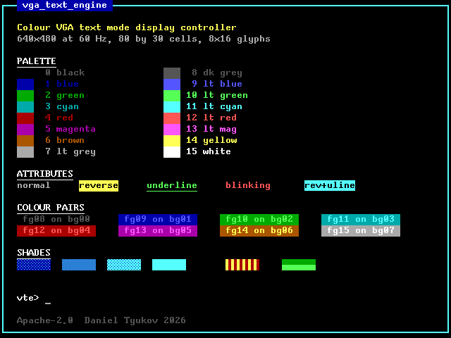

Every screenshot in this README is the RGB output of the RTL, captured pixel by pixel
during active video by a testbench and written straight to disk. None of them are mock
ups, and every one is also checked against an independent Python model of the renderer
on every test run.

## Contents

- [Features](#features)
- [Architecture](#architecture)
- [Video modes](#video-modes)
- [Character cell format](#character-cell-format)
- [Register map](#register-map)
- [Programming sequence](#programming-sequence)
- [Interfaces](#interfaces)
- [Parameters](#parameters)
- [Gallery](#gallery)
- [Verification](#verification)
- [Silicon](#silicon)
- [Repository layout](#repository-layout)
- [Licence](#licence)

## Features

Compared with a plain monochrome fixed font text controller:

| | plain monochrome controller | `vga_text_engine` |
|---|---|---|
| Colour | one intensity, on or off | per character foreground and background from a 16 entry programmable palette |
| Palette depth | none | RGB444 per entry, expanded to any DAC width from 1 to 12 bits per channel |
| Cursor | not processed | hardware cursor with programmable row, column, scanline span, blink divider and enable |
| Character effects | none | blink, reverse video and underline, per character |
| Glyph height | fixed 8x8 | 8x8 and 8x16, both resident in the ROM, switched by one register bit with no reload |
| Video modes | one hardcoded timing | 640x480@60, 800x600@60, 1024x768@60 and 720x400@70, selected by a register, table driven |
| Sync polarity | fixed | per mode, taken from the VESA table |
| Memory underrun | silent corruption | detected, counted, reported in a sticky status bit, and repaired at the next frame boundary |
| Reconfiguration | tears across a frame | the whole configuration is snapshotted atomically once per frame |
| Clocking | single clock | separate register and pixel clocks with a proper gray coded crossing |
| Text grid | fixed | columns and rows programmable, clamped to the active area, border colour outside the grid |
| Register interface | ad hoc | AXI4-Lite subordinate with byte strobes and an exhaustively tested map |
| Verification | visual inspection | pixel exact against an independent renderer, at RTL and at the gate level |
| Physical evidence | none | real 130 nm standard cell area and per mode timing closure on an open PDK |

## Architecture

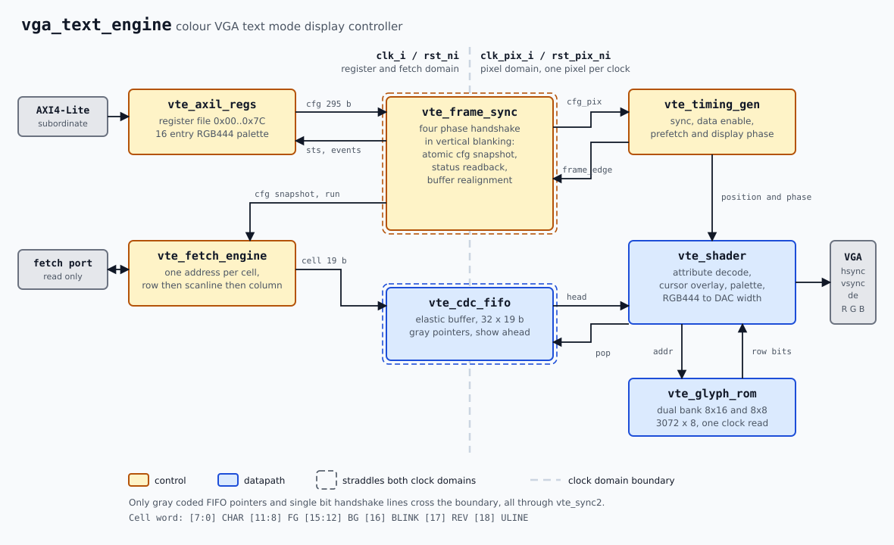

Two clock domains:

- `clk_i` runs the AXI4-Lite subordinate and the cell fetch port. Any convenient system
  frequency.
- `clk_pix_i` runs the sync generator and the shader at one pixel per clock, so it must
  be the exact pixel clock of the selected mode.

Everything that crosses between them goes through `vte_frame_sync`, which runs a four
phase level handshake once per frame inside vertical blanking. That one mechanism does
three jobs:

1. **Atomic reconfiguration.** While the producer is parked, its shadow copy of the
   register file is frozen and provably stable, so the pixel domain samples all 295
   configuration bits at once. A palette rewrite or a geometry change lands as a single
   frame update; software never sees a torn configuration.
2. **Status readback.** The frame and underrun counters live in the pixel domain. They
   only change outside the handshake window, so the register domain samples them at the
   same quiescent point.
3. **Self healing alignment.** The pixel pipeline consumes exactly
   `cols * rows * glyph_h` cells per frame and the fetch engine produces exactly that
   many, so the buffer index mapping never drifts on its own. An underrun breaks that
   invariant. Draining the buffer once per frame while the producer is parked makes any
   drift heal within one frame instead of persisting forever.

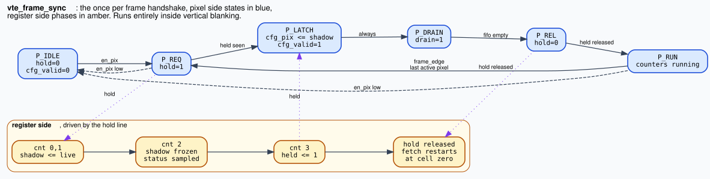

The pixel pipeline spends three register stages inside the eight pixel budget of one
character cell, which buys the glyph ROM a full clock of read latency and lets it map to
a block RAM:

| phase within the cell | action |
|---|---|
| 5 | pop the elastic buffer, capture the cell |
| 6 | drive the glyph ROM address |
| 7 | capture the attribute half of the cell |
| next cell group | the ROM output and the attributes are both valid for all 8 display pixels |

Because a line is walked SYNC, BACK PORCH, ACTIVE, FRONT PORCH, the whole blanking gap
before active video is one contiguous run at the low end of the horizontal counter. The
eight pixel prefetch window therefore sits inside the back porch and never has to wrap
around the end of a line.

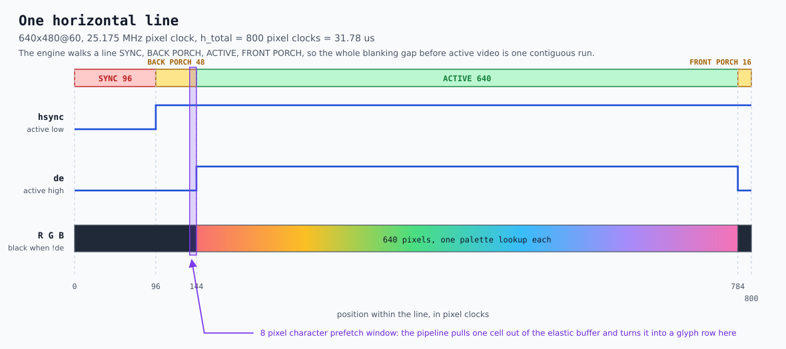

Attribute resolution order, which the Python reference renderer reimplements
independently and the test suite checks pixel for pixel:

1. pixel = glyph bitmap bit, most significant bit leftmost
2. `ULINE` forces the pixel on when the glyph row equals `CURSHAPE.ULINE_ROW`
3. `BLINK` forces the pixel off during the off phase of the `TXT_DIV` divider
4. `REV` swaps the foreground and background palette indices
5. the cursor inverts the pixel inside `CURSHAPE.START .. CURSHAPE.END`
6. palette index = pixel ? foreground : background
7. inside active video but outside the text grid: `CTRL.BORDER`
8. the RGB444 entry is expanded to the per channel DAC width by nibble replication

## Video modes

`CTRL.MODE` selects a row of the table in `rtl/vte_modes_pkg.sv`. All four are VESA DMT
timings and the test suite measures every count on the pins.

| MODE | resolution | pixel clock | h active | h front | h sync | h back | h total | v active | v front | v sync | v back | v total | hsync | vsync | refresh |
|---|---|---|---|---|---|---|---|---|---|---|---|---|---|---|---|
| 0 | 640x480 | 25.175 MHz | 640 | 16 | 96 | 48 | 800 | 480 | 10 | 2 | 33 | 525 | negative | negative | 59.94 Hz |
| 1 | 800x600 | 40.000 MHz | 800 | 40 | 128 | 88 | 1056 | 600 | 1 | 4 | 23 | 628 | positive | positive | 60.32 Hz |
| 2 | 1024x768 | 65.000 MHz | 1024 | 24 | 136 | 160 | 1344 | 768 | 3 | 6 | 29 | 806 | negative | negative | 60.00 Hz |
| 3 | 720x400 | 28.322 MHz | 720 | 18 | 108 | 54 | 900 | 400 | 12 | 2 | 35 | 449 | negative | positive | 70.09 Hz |

Character grid capacity at the two glyph heights:

| mode | 8x8 grid | 8x16 grid |
|---|---|---|
| 640x480 | 80 x 60 | 80 x 30 |
| 800x600 | 100 x 75 | 100 x 37 |
| 1024x768 | 128 x 96 | 128 x 48 |
| 720x400 | 90 x 50 | 90 x 25 |

Adding a mode is one `localparam` in `vte_modes_pkg.sv` and one case arm in
`vte_mode_lut.sv`. Nothing else in the design knows how many modes exist, and
`vte_mode_lut` re-derives the summary constants and both sync polarities from the table
at elaboration time so a bad edit fails loudly.

## Character cell format

One 32 bit word in the fetch address space describes one cell. The word index is
`row * GEOM.COLS + col` and the byte address is `BASE + 4 * index`.

| bits | field | meaning |
|---|---|---|
| `[7:0]` | `CHAR` | glyph index. 0 to 127 index the ROM; 128 and above render as an empty cell |
| `[11:8]` | `FG` | foreground palette index |
| `[15:12]` | `BG` | background palette index |
| `[16]` | `BLINK` | the character blinks at the `BLINK.TXT_DIV` rate |
| `[17]` | `REV` | reverse video, swaps `FG` and `BG` |
| `[18]` | `ULINE` | light the glyph row selected by `CURSHAPE.ULINE_ROW` |
| `[31:19]` | reserved | ignored, not carried into the elastic buffer |

Glyph codes 0x20 to 0x7E are printable ASCII. Codes 0x01 to 0x0D hold three shade
patterns, a solid block, left and lower half blocks, a bullet, and six box drawing
pieces whose rules join up at either glyph height.

## Register map

AXI4-Lite, 32 bit data, byte strobes honoured. The window is 256 bytes; an access
outside it reads as zero and a write to it is dropped. Reserved bits read as zero and
ignore writes. Every response is `OKAY`.

| offset | name | access | reset | description |
|---|---|---|---|---|
| `0x00` | `ID` | RO | `0x56544501` | identification, "VTE" plus revision |
| `0x04` | `CTRL` | RW | `0x00000002` | enable, glyph height, mode, border |
| `0x08` | `STATUS` | RO + W1C | - | running, vertical blanking, sticky flags, buffer level |
| `0x0C` | `GEOM` | RW | `0x001E0050` | text grid size, 80 by 30 |
| `0x10` | `BASE` | RW | `0x00000000` | byte address of the cell buffer |
| `0x14` | `CURSOR` | RW | `0x00000000` | cursor position and enable |
| `0x18` | `CURSHAPE` | RW | `0x000F0F0E` | cursor scanline span and underline row |
| `0x1C` | `BLINK` | RW | `0x000F000F` | cursor and text blink dividers |
| `0x20` | `FRAME` | RO | `0x00000000` | frames completed since enable |
| `0x24` | `MODEDIM` | RO | `0x01E00280` | active size of the mode the pixel domain latched |
| `0x28` | `UNDERRUN` | RO | `0x00000000` | underrun event count, saturating at 65535 |
| `0x2C` | `SCRATCH` | RW | `0x00000000` | free 32 bit register, no hardware effect |
| `0x40` to `0x7C` | `PAL0` to `PAL15` | RW | see below | palette entries |

### `CTRL` at `0x04`

| bits | field | description |
|---|---|---|
| `[0]` | `EN` | 1 enables the engine. Timing starts from the top of a frame with the configuration already snapshotted, so the first frame after enable is fully correct |
| `[1]` | `FONT_H16` | 0 selects 8x8 glyphs, 1 selects 8x16. Reset value is 1 |
| `[2]` | `BLANK` | 1 forces the colour outputs black while sync and data enable keep running |
| `[7:4]` | `MODE` | video mode index. An index past the end of the table falls back to mode 0 |
| `[11:8]` | `BORDER` | palette index used inside active video but outside the text grid |
| `[31:12]` | reserved | |

### `STATUS` at `0x08`

| bits | field | access | description |
|---|---|---|---|
| `[0]` | `RUNNING` | RO | the pixel pipeline holds a valid configuration snapshot |
| `[1]` | `VBLANK` | RO | the pixel pipeline is outside active video. Reads 1 while disabled |
| `[2]` | `UNDERRUN` | W1C | sticky: the elastic buffer ran dry at least once. Write 1 to clear |
| `[3]` | `FRAME` | W1C | sticky: at least one frame completed. Write 1 to clear |
| `[15:8]` | `FIFO_LEVEL` | RO | elastic buffer occupancy in cells, a conservative write domain estimate |
| `[31:16]` | reserved | | |

### `GEOM` at `0x0C`

| bits | field | description |
|---|---|---|
| `[7:0]` | `COLS` | text columns. Clamped for display to `h_active / 8`, but the buffer row stride stays at the programmed value |
| `[15:8]` | reserved | |
| `[23:16]` | `ROWS` | text rows. Clamped for display to `v_active / glyph_h` |
| `[31:24]` | reserved | |

### `CURSOR` at `0x14`

| bits | field | description |
|---|---|---|
| `[7:0]` | `COL` | cursor column |
| `[15:8]` | reserved | |
| `[23:16]` | `ROW` | cursor row |
| `[30:24]` | reserved | |
| `[31]` | `EN` | 1 draws the cursor |

### `CURSHAPE` at `0x18`

| bits | field | description |
|---|---|---|
| `[3:0]` | `START` | first glyph scanline the cursor covers |
| `[7:4]` | reserved | |
| `[11:8]` | `END` | last glyph scanline the cursor covers. `START` above `END` draws nothing |
| `[15:12]` | reserved | |
| `[19:16]` | `ULINE_ROW` | glyph scanline lit by the `ULINE` cell attribute |
| `[31:20]` | reserved | |

### `BLINK` at `0x1C`

| bits | field | description |
|---|---|---|
| `[7:0]` | `CUR_DIV` | the cursor phase toggles every `CUR_DIV + 1` frames, so the period is `2 * (CUR_DIV + 1)` frames at 50 percent duty |
| `[15:8]` | reserved | |
| `[23:16]` | `TXT_DIV` | the same for the `BLINK` cell attribute |
| `[31:24]` | reserved | |

Both phases start visible on the first frame after enable.

### `MODEDIM` at `0x24`

| bits | field | description |
|---|---|---|
| `[11:0]` | `H_ACTIVE` | active pixels per line of the latched mode |
| `[15:12]` | reserved | |
| `[27:16]` | `V_ACTIVE` | active lines per frame of the latched mode |
| `[31:28]` | reserved | |

### `PAL0` to `PAL15` at `0x40` to `0x7C`

| bits | field | description |
|---|---|---|
| `[3:0]` | `B` | blue nibble |
| `[7:4]` | `G` | green nibble |
| `[11:8]` | `R` | red nibble |
| `[31:12]` | reserved | |

Each nibble is expanded to the per channel DAC width by replication, so it is exact at
widths 4, 8 and 12 and monotonic in between. The reset palette is the conventional 16
colour text palette:

| index | value | colour | index | value | colour |
|---|---|---|---|---|---|
| 0 | `0x000` | black | 8 | `0x555` | dark grey |
| 1 | `0x00A` | blue | 9 | `0x55F` | light blue |
| 2 | `0x0A0` | green | 10 | `0x5F5` | light green |
| 3 | `0x0AA` | cyan | 11 | `0x5FF` | light cyan |
| 4 | `0xA00` | red | 12 | `0xF55` | light red |
| 5 | `0xA0A` | magenta | 13 | `0xF5F` | light magenta |
| 6 | `0xA50` | brown | 14 | `0xFF5` | yellow |
| 7 | `0xAAA` | light grey | 15 | `0xFFF` | white |

## Programming sequence

```c
#define VTE 0x40010000u
#define R(o) (*(volatile uint32_t *)(VTE + (o)))

R(0x0C) = (30u << 16) | 80u;               // GEOM: 80 by 30 cells
R(0x10) = 0x80000000u;                     // BASE: cell buffer address
R(0x14) = (1u << 31) | (0u << 16) | 0u;    // CURSOR: enabled at row 0, column 0
R(0x18) = (15u << 16) | (15u << 8) | 14u;  // CURSHAPE: underline row 15, cursor rows 14 to 15
R(0x1C) = (15u << 16) | 15u;               // BLINK: both dividers at 15
R(0x40 + 4 * 1) = 0x00F;                   // PAL1: a brighter blue
R(0x04) = (1u << 8) | (0u << 4) | (1u << 1) | 1u;  // CTRL: border 1, mode 0, 8x16, enable
```

Everything except `CTRL.EN` may also be written while the engine is running. The change
takes effect on the next frame boundary, all at once. Changing `CTRL.MODE` while enabled
is allowed but the frame during which the new geometry is latched will be short or long;
disable, reprogram and re-enable if that matters.

## Interfaces

### AXI4-Lite subordinate

Standard five channel AXI4-Lite with 32 bit data. One outstanding transaction in each
direction: `AWREADY` and `WREADY` drop while a write response is pending, and `ARREADY`
drops while read data is pending. `AWPROT` and `ARPROT` are accepted and ignored.

### Cell fetch port

A deliberately small read only port, easy to bridge to AXI, OBI, Wishbone or a plain
SRAM. At most one read is outstanding at a time, and a new request may be offered in the
same cycle the previous response returns, so a zero wait state target sustains one cell
per clock.

| signal | direction | description |
|---|---|---|
| `fetch_req_o` | out | a read is offered; `fetch_addr_o` is valid in the same cycle |
| `fetch_addr_o` | out | byte address, always 4 byte aligned |
| `fetch_gnt_i` | in | the target accepted the address this cycle |
| `fetch_rvalid_i` | in | read data is returned. May be the cycle after the grant or later |
| `fetch_rdata_i` | in | the 32 bit cell word |

The engine only offers a request when the elastic buffer has room for both the response
it is already owed and the response the new request will produce, so a fetched cell can
never be dropped.

Peak demand is one cell per eight pixel clocks over the text area. The worst case in the
table is 1024x768 at 65 MHz with 128 columns: 128 cells per 1344 pixel clock line, which
is 6.19 million cells per second. At a 50 MHz register clock with a zero wait state
target the port delivers 50 million cells per second, so the headroom is 8 times.
[`docs/design.md`](docs/design.md) works the numbers through for every mode.

### Video output

`hsync_o`, `vsync_o`, `de_o` and the three colour buses are all registered on
`clk_pix_i` and change together, so downstream logic sees one aligned set of signals.
Outside active video the colour outputs are forced to zero. While disabled, both sync
pins park at their inactive level for the selected mode.

### Event outputs

`frame_o` and `underrun_o` are one clock wide pulses in the `clk_i` domain, raised when
the once per frame status sample sees the corresponding pixel domain counter advance.
They are the same events that set `STATUS.FRAME` and `STATUS.UNDERRUN`, exported for a
system that would rather take an interrupt than poll. There is no interrupt controller,
mask or priority: wire them into whatever the rest of the system uses.

## Parameters

| parameter | default | range | description |
|---|---|---|---|
| `RedW`, `GreenW`, `BlueW` | 8 | 1 to 12 | per channel DAC width |
| `FifoDepth` | 32 | power of two, at least 8 | elastic buffer depth in cells |
| `AxiAddrW` | 12 | at least 8 | AXI4-Lite address width. Only the low 8 bits are decoded |
| `FetchAddrW` | 32 | 16 to 32 | fetch port address width |

Every parameter is range checked in an elaboration time `assert`, and the mode table
summary constants are re-derived from the table and checked against their hand written
values. All the checks sit behind `` `ifndef SYNTHESIS `` so they cost nothing in
hardware. `make lint-config` lints a second parameter set with RGB444 outputs, a
64 entry buffer and a 24 bit fetch address to keep the parameterisation honest.

## Gallery

### 16 by 16 colour matrix

Every foreground index against every background index, plus solid blocks and a 50
percent shade over the complementary index.

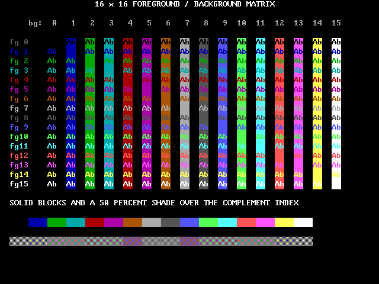

### Attribute decode

Reverse video, underline, blink and their combinations, the block cursor at full cell
height, and out of range glyph codes rendering blank on a coloured background.

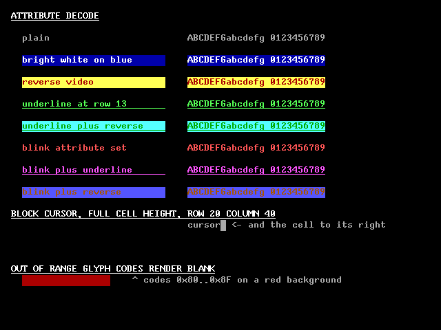

### Both glyph heights

The same text at 8x16 and at 8x8, cropped out of two RTL frames. The captions are the
engine's own glyphs, not an annotation added afterwards.

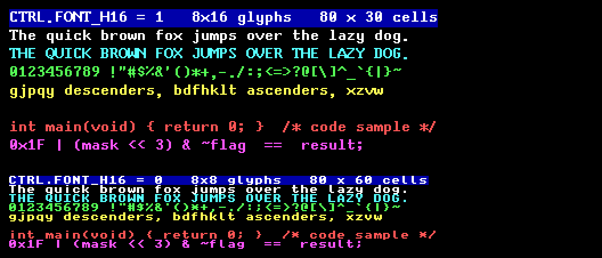

The full screens the crops come from. Identical 640x480 timing, identical cell buffer
layout, one register bit apart: 80 by 30 cells at 8x16, 80 by 60 at 8x8.

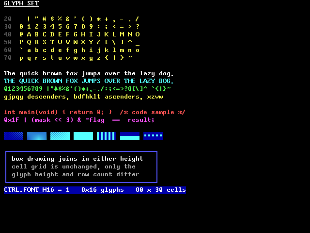

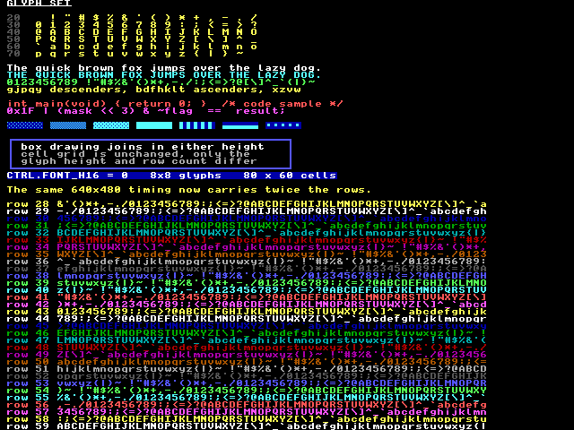

### Hardware cursor blinking

Eight consecutive simulated frames with `CUR_DIV = 1`, so the cursor phase flips every
two frames, and `TXT_DIV = 3`, so the blinking attribute flips every four.

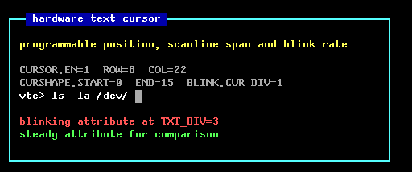

### 1024x768

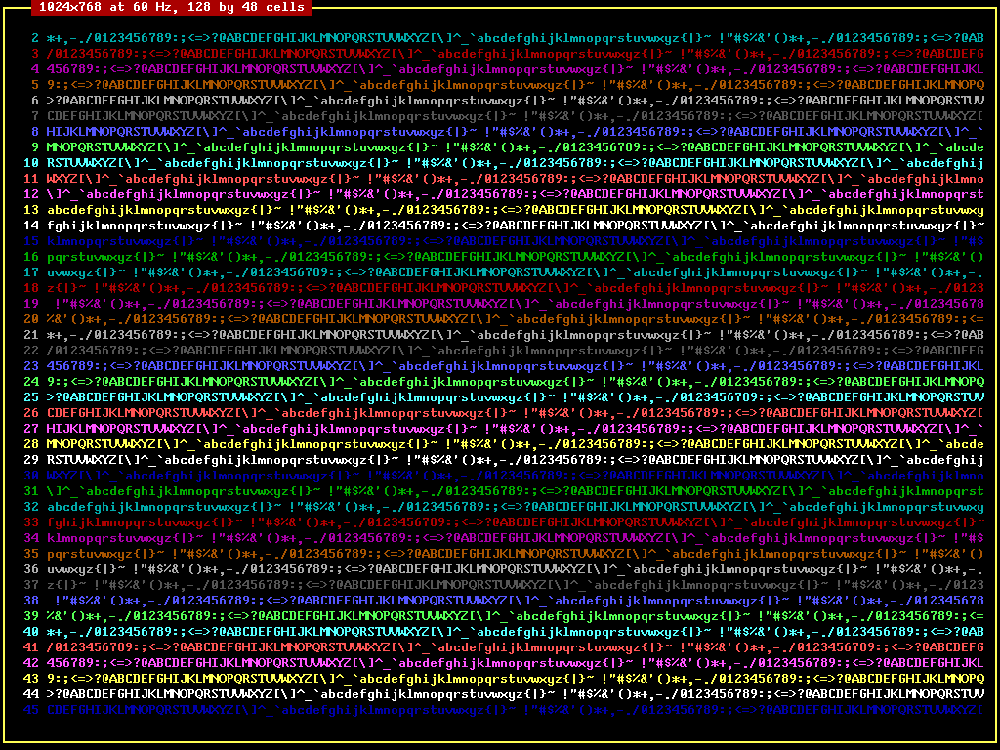

## Verification

```
make venv     # once, creates .venv and installs pillow, numpy and matplotlib
make lint     # Verilator -Wall, no warnings allowed
make test     # build and run everything
make images   # regenerate docs/img from simulation output
make all      # lint both parameter sets, test, synthesise, time
```

Toolchain: Icarus Verilog 12.0, Verilator 5.020, Yosys 0.33, OpenSTA 3.1.0 through
OpenROAD, Python 3.12, and the IHP Open PDK SG13G2. The RTL is written in a SystemVerilog
subset every one of those tools reads, so nothing here needs a commercial licence.

Fourteen cases, all passing, about 160 seconds of wall clock at `-j 8`:

| case | what it proves |
|---|---|
| `timing/mode0` to `timing/mode3` | every horizontal and vertical count and both sync polarities match VESA, and no line in the frame deviates |
| `frame/demo` | colour pairs, box drawing, shades, cursor, underline and blink together |
| `frame/palette` | all 256 foreground and background combinations |
| `frame/attr` | reverse, underline, blink in its off phase, a full height cursor, out of range glyph codes |
| `frame/font16`, `frame/font8` | both glyph heights, including a 60 row grid |
| `frame/cursor` | the cursor scene at a short blink divider |
| `frame/mode1024` | a 128 by 48 grid at 1024x768 |
| `regs` | 124 checks over the whole register map |
| `blink` | cursor and attribute blink period and duty in frames |
| `underrun` | starvation, sync stability, and self healing alignment |

How each one works:

**Timing conformance** measures the pins rather than peeking at counters. It times the
runs of each sync level and the position of the data enable window relative to the end
of the sync pulse, recording a minimum and a maximum per quantity over a whole frame, so
one irregular line out of hundreds shows up as `min != max`. `scripts/check_timing.py`
asserts every count against `scripts/modes.py`, which carries the VESA figures written
out independently of the RTL package, and confirms both polarities from the raw level run
lengths. A typo on either side fails instead of cancelling out.

**Pixel exact frame comparison** captures whole frames out of the RTL as binary PPM.
`scripts/model.py` is a second, independent implementation of the display path written
from the register map and the documented resolution order. The two share only the glyph
bitmaps and the stimulus files, so a disagreement points at a renderer and not at the
scene description. Any single differing byte fails. 640x480 is 307200 pixels and
1024x768 is 786432, and all of them are checked.

**Register map walk** covers identification, reset values, every read/write register at
all ones, all zeros and two walking patterns to pin down the implemented bit mask, read
only registers proof against writes, reserved and unmapped addresses reading zero, byte
strobes including a no-strobe no-op, and write one to clear on both sticky flags.

**Blink** watches one pixel inside the cursor cell and one inside a solid blinking block
for sixteen consecutive frames, turns the two columns into run lengths, asserts the
period and duty against the programmed dividers, then cross checks every frame against
the phase the reference model predicts from the frame index.

**Underrun** starves the fetch port for longer than a frame. It asserts that the hsync
period stays at exactly one value throughout, that the sticky flag latches and the event
counter advances, that the flag clears on a write of one and stays clear afterwards, and
that a frame captured after recovery matches the reference model pixel for pixel. That
last check is what proves the frame boundary handshake repairs the cell alignment rather
than only reporting the fault.

Running one case at a time:

```
.venv/bin/python scripts/run_tests.py --only timing
.venv/bin/python scripts/run_tests.py --only frame/attr
.venv/bin/python scripts/run_tests.py --only underrun -v
```

A single simulation by hand, for waveform work:

```
.venv/bin/python scripts/scenes.py -o results/scenes demo
vvp results/sim/tb_vte_frame.vvp \
    +regs=results/scenes/demo.regs +mem=results/scenes/demo.mem \
    +ppm=results/sim/demo +width=640 +height=480 +skip=1 +frames=1 +ascii
```

`+ascii` prints the first 32 captured lines as coarse art, which is usually enough to
spot a pipeline problem without opening a waveform viewer.

## Silicon

The design is synthesised, timed and gate level simulated against the
[IHP Open PDK SG13G2](https://github.com/IHP-GmbH/IHP-Open-PDK), an open source 130 nm
BiCMOS process, so the numbers below are real standard cell area and real static timing
rather than generic gate counts.

```
make synth     # Yosys to sg13g2 cells, three corners, docs/pdk_area_report.txt
make sta       # OpenSTA per video mode and per corner, docs/sta_report.txt
make gatesim   # simulate the mapped netlist, diff it against the reference renderer
make pdk       # all three
```

### Area

Signoff corner slow, 1.08 V, 125 C. Full report:
[`docs/pdk_area_report.txt`](docs/pdk_area_report.txt).

| metric | value |
|---|---|
| standard cell area | 175 325 um2, 0.175 mm2 |
| cell instances | 8 777 |
| flip flops | 1 955 |
| equivalent NAND2 gates | 31 059 |
| inferred latches | 0 |
| unmapped cells | 0 |

Area is identical at all three corners, which is what should happen: Liberty cell areas
are process independent, so only the timing moves. This is cell area after mapping, before
place and route, so it excludes routing, filler and tap cells.

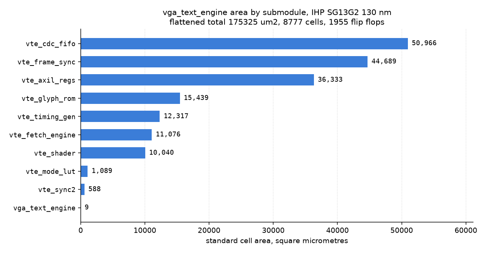

Where it goes: the elastic buffer and the frame synchroniser together are 52 percent of
the design, and both are storage. The buffer is 32 entries of 19 bits held in flip flops
because a 130 nm standard cell library has no small dual port RAM, and the synchroniser
carries two extra copies of the 295 bit configuration bundle, one frozen shadow in the
register domain and one live in the pixel domain. That is the price of atomic
reconfiguration, and it is worth knowing what it costs: about a quarter of the area buys
software the guarantee that it never sees a torn frame.

The glyph ROM is 3072 bytes of constant data mapped to logic, since the standard cell
library has no ROM primitive. On an FPGA, or with an SRAM macro from the same PDK, it
becomes one memory block and 8.5 percent of the area disappears.

### Timing

OpenSTA through OpenROAD, slow corner. Full report including both critical paths:
[`docs/sta_report.txt`](docs/sta_report.txt).

| mode | pixel clock needed | minimum period | slack | headroom | verdict |
|---|---|---|---|---|---|
| 640x480@60 | 25.175 MHz | 10.420 ns | +29.302 ns | 3.8x | met |
| 800x600@60 | 40.000 MHz | 10.420 ns | +14.580 ns | 2.4x | met |
| 1024x768@60 | 65.000 MHz | 10.420 ns | +4.965 ns | 1.5x | met |
| 720x400@70 | 28.322 MHz | 10.420 ns | +24.888 ns | 3.4x | met |

Every mode in the table closes at the slow corner. The pixel pipeline is one pixel per
clock with no multi-cycle paths, so the critical path does not depend on the mode: the
minimum period is the same in every row and only the requirement changes.

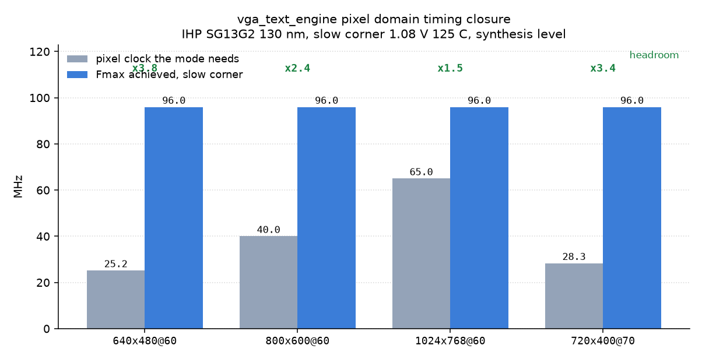

Maximum frequency per corner:

| corner | supply | temperature | `clk_pix_i` | `clk_i` |
|---|---|---|---|---|
| slow | 1.08 V | 125 C | 95.96 MHz | 71.26 MHz |
| typical | 1.20 V | 25 C | 150.27 MHz | 111.17 MHz |
| fast | 1.32 V | -40 C | 227.85 MHz | 152.38 MHz |

These are synthesis level numbers: ideal clock networks, no wire load model, and no fanout
repair. They are also load limited rather than logic limited, which is worth being
explicit about. Both critical paths are only a few gates deep, and almost all of the delay
is one unbuffered net: 419 loads for 11.50 ns in the register domain, 155 loads for
7.33 ns in the pixel domain. Those nets are the enables that gate the 295 bit
configuration snapshot, so a single signal reaches several hundred flip flop enable inputs
and `abc` drives it from a minimum size gate. A place and route flow inserts a buffer tree
there and the stage collapses, so the frequencies above understate the built design. They
are quoted as measured rather than adjusted, and every video mode closes anyway.

### Gate level check

`make gatesim` runs the same frame capture testbench against the mapped netlist and the
PDK's behavioural cell models, then diffs the captured frame against the independent
Python reference renderer. It is the strongest statement available about the synthesis
result: the netlist Yosys emitted renders exactly the pixels the RTL does, all 307 200 of
them, with no structural argument required.

The PDK cell models need one rewrite before Icarus Verilog will read them. Their `specify`
blocks use `ifnone` with edge sensitive paths, which Icarus rejects, and the sequential
cells route their inputs through `delayed_CLK`, `delayed_D` and `delayed_RESET_B` wires
that the `specify` block is what drives. Deleting the blocks leaves those wires
permanently X and the whole design goes X. All 505 delay assignments in the file are
`(0.0, 0.0)`, so `scripts/gatesim.py` rewrites each block into the zero delay identity it
stands for, `assign delayed_X = X`, and refuses to run if a non zero delay ever appears or
if a delayed wire has no port to alias.

### Implementation notes

`clk_i` and `clk_pix_i` are asynchronous. The only paths between them are the gray coded
FIFO pointers and the single bit handshake lines, all through `vte_sync2`, so declare them
as separate clock groups; `synth/sta.tcl.in` shows the constraint. `clk_i` must be at
least `clk_pix_i / 1000` for the frame handshake to fit inside vertical blanking, which
any realistic system clock satisfies by a wide margin.

## Repository layout

| path | description |
|---|---|
| `rtl/vga_text_engine.sv` | top level |
| `rtl/vte_modes_pkg.sv` | video mode timing table |
| `rtl/vte_pkg.sv` | shared types, cell format, palette, register map |
| `rtl/vte_mode_lut.sv` | mode table lookup and the elaboration time table checks |
| `rtl/vte_axil_regs.sv` | AXI4-Lite subordinate register file |
| `rtl/vte_frame_sync.sv` | the only module that spans both clock domains |
| `rtl/vte_fetch_engine.sv` | cell address sequencer |
| `rtl/vte_cdc_fifo.sv` | dual clock elastic buffer |
| `rtl/vte_timing_gen.sv` | sync generator and character grid addressing |
| `rtl/vte_shader.sv` | attribute decode, cursor overlay, palette lookup |
| `rtl/vte_glyph_rom.sv` | generated dual bank glyph ROM |
| `rtl/vte_sync2.sv` | two stage synchroniser |
| `tb/` | testbenches and the AXI4-Lite manager tasks |
| `scripts/font_data.py` | hand authored 8x8 and 8x16 bitmaps, the single source of truth |
| `scripts/model.py` | independent Python reference renderer |
| `scripts/modes.py` | VESA figures, written out independently of the RTL |
| `scripts/scenes.py` | scene stimulus generator |
| `scripts/run_tests.py` | test runner |
| `scripts/make_images.py` | regenerates everything in `docs/img` |
| `scripts/pdk.py` | IHP SG13G2 paths and corner definitions |
| `scripts/synth_sg13g2.py` | synthesis to real standard cells, area report and chart |
| `scripts/sta_sg13g2.py` | per mode and per corner static timing analysis |
| `scripts/gatesim.py` | gate level simulation of the mapped netlist |
| `docs/design.md` | microarchitecture decisions, buffer sizing maths, verification plan |
| `docs/pdk_area_report.txt` | committed standard cell area and cell histogram |
| `docs/sta_report.txt` | committed timing reports including both critical paths |
| `synth/synth_sg13g2.ys.in` | Yosys script template |
| `synth/sta.tcl.in` | OpenSTA constraint template |

The glyph ROM is generated. After editing `scripts/font_data.py`, run `make font` to
regenerate `rtl/vte_glyph_rom.sv`.

## Licence

Apache-2.0. Copyright 2026 Daniel Tyukov. See [LICENSE](LICENSE).
